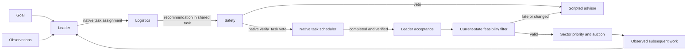

# SwarmMind response team

An optional multi-agent application for simulated disaster search and rescue. A rescue
lead proposes work, a logistics specialist challenges unsupported plans, and a safety
reviewer can veto dispatch. Their reviewed sector orders affect the existing auction;
the auction and robot reflexes continue independently when the team is unavailable.

This is a simulated coordination demonstration, not a deployed emergency-response
system. It demonstrates collaboration and failure handling. No improvement in rescue
score over a single agent or the scripted baseline has been established.

## Install once

Use Python 3.12 through `uv`, as the main project requires:

```bash
uv sync
./scripts/setup_response_team.sh
```

WorkSwarm **0.2.6** and its resolved dependencies are pinned in
[`requirements.lock`](../integrations/workswarm/requirements.lock), in a separate
`integrations/workswarm/.venv`. The core environment does not import WorkSwarm. The
lock was verified on macOS arm64 / Python 3.12; other platforms are unverified.
Installation and OpenRouter inference need network access. The scripted fallback works
without a model connection. The first framework import has a separate startup budget.

Inference goes through **OpenRouter** (`https://openrouter.ai/api/v1`, OpenAI-compatible).
The default model is `openai/gpt-5.6-terra`, chosen by measuring 15 models on this
project's own request shapes ([M-88](MEASUREMENTS.md)), configured in
`assets/scenarios/team_response.yaml`. Set `OPENROUTER_MODEL` to override it with an
OpenRouter model supporting strict structured outputs; per-model request quirks live in
`TUNING` in `providers/openai_api.py`, and an unlisted model gets a cautious default.
Anthropic models are not usable here: the two flagships refuse this prompt outright. Keys are read only from
`OPENROUTER_API_KEY`; no key belongs in YAML, source files, trace logs, or Git. Every
OpenRouter request sets `provider.require_parameters`, so it is only routed to hosts that
honour the JSON schema. `.env` is gitignored and is not loaded implicitly; pass it with
`uv run --env-file .env` (template: `.env.example`).
The local GGUF launcher is an optional legacy path and is not needed for OpenRouter.

## Run the real application

Put the key in `.env` (`OPENROUTER_API_KEY=sk-or-v1-...`), then:

```bash
uv run --env-file .env python -m swarmmind.cli run --demo --response-team --team-trace runs/team/live.jsonl
```

For the regular single-provider hivemind:

```bash
uv run --env-file .env python -m swarmmind.cli run --demo --hivemind-allow-api
```

The team worker inherits the environment, so the key reaches it without extra flags.
In PowerShell, set `$env:OPENROUTER_API_KEY` instead of using `--env-file`.

The native team still requires its isolated WorkSwarm environment. On Windows supply
`--team-python integrations/workswarm/.venv/Scripts/python.exe` if that is where the
framework was installed; the original setup script targets macOS/Linux.
`--response-team local` uses the simpler role workflow with the same configured OpenRouter
endpoint; the legacy mode name describes the workflow, not where inference runs.
`--headless` stays model-free, and `--response-team heuristic` needs no API key.

Historical examples and measurements below used Qwen. They are retained as historical
evidence, not validation of the hosted configuration. The first live OpenRouter checks
are in [M-87](MEASUREMENTS.md) and [M-88](MEASUREMENTS.md): wiring, model selection and
latency, including 180 s demo-map runs. Neither measures rescue uplift.

Open `godot/` in Godot and run its main scene. Keep terminal 2 beside it: the dashboard
shows sector effects, while the terminal shows the role handoffs and proposal IDs.
The user goal is optional; the default is in
[`team_response.yaml`](../assets/scenarios/team_response.yaml). Only seeds 42–45 are
the demo maps. The response team is not trained or fine-tuned on these maps.

For a short real-runtime check, use `--scenario test --max-time 65` and omit `--wait`.
For rule-based verification without a model or dashboard:

```bash
uv run python -m swarmmind.cli run --headless --scenario test \
  --response-team heuristic --max-time 40
```

That mode is explicitly **heuristic**, not an LLM demo. An ordinary headless command
without `--response-team` retains its original behavior and deterministic hash.
`--response-team local` retains the earlier role workflow with a smaller custom coordinator;
it must be described as custom orchestration, not WorkSwarm. `--team-python` can select
an alternative isolated interpreter. `--no-hivemind` remains the Tier-3-silent control.

## What the agents contribute

| Role | Reads | Authority |
|---|---|---|
| Rescue lead | Observed work candidates, mission goal, previous decision/outcomes | Propose a sector order; accept or decline a peer revision |
| Logistics | In-contact capacity, observed rescue backlog, feasible alternatives | Challenge the lead; propose another candidate or withhold |
| Safety | Independent preflight check and recent outcome context | Approve the agreed proposal or veto it |



`--response-team` uses the official **native Leader/Teammate system**, through
`TeamAgentSpec`, `LeaderSpec`, `TeamMemberSpec` and
`Runner.run_agent_team_streaming`. The native runtime owns member execution, shared
tasks, scheduler messages, logistics handoff, reviewer invocation, vote settlement
and notification back to the leader. Members run in-process inside one isolated worker.
Safety uses the scheduler's reviewer-scoped **`VerifyTaskTool`**; its model configuration
is explicit because this SDK version does not inherit it from the team model pool.

Our rescue tools wrap native task creation/completion and constrain candidate selection.
SDK rails enforce each role's permissions, compact prompts and bound model calls.
A small client extension registered through the SDK subclasses `OpenAIModelClient`:
it requests JSON-schema-constrained arguments from the configured model, validates them, and
returns an SDK `ToolCall`. This works around the installed llama.cpp build ignoring
required-tool selection. It does not choose arguments, invent votes, or execute tools;
the native runtime remains responsible for coordination and execution. The four model
responses are real inference (OpenRouter by default). Native SDK tests use an explicitly
labeled HTTP response fixture instead. The adapter sends no tools, so it also drops
`parallel_tool_calls`; no OpenRouter host accepts that field, and with
`require_parameters` it made every route fail with HTTP 404 (M-87).
With a loopback endpoint, `api_key="local-no-secret"` is a placeholder required by the
compatible client, not a cloud credential. Reviewed team orders are published with
source `api` for the hosted endpoint and `base-local` for loopback. The native runtime invokes each agent's registered model client;
application orchestration does not call teammates directly. The old SwarmFlow
`AgentBackend` is not used on this path. The prior `swarmflow.py` is historical only.

The team topology and rescue task decomposition are predefined. The model chooses a
candidate, an alternative, or a veto; the scheduler controls who runs next. This is a
bounded native-team application, not unrestricted dynamic agent spawning. Generic
filesystem, shell, browser, MCP, evolution and fork capabilities are disabled or excluded
by the tool allowlist. A temporary SQLite task database is removed after each episode;
previous observed outcomes cross episodes through the next snapshot.

Roles share one model endpoint with separate contexts and authority. Logistics can
change the recommendation, safety can veto it, and the leader must accept the exact
verified choice. A final simulator filter still checks age and current feasibility.
The earlier M-79 traces used SwarmFlow; they are **not native Leader/Teammate evidence**.

## End-to-end demonstration

1. Start the mission and explain the user goal. Show `LIVE TEAM (workswarm)` once ready.
2. Follow one proposal ID through lead, logistics, safety, and final leader acceptance. Use the recorded tool
   evidence to explain the choice; small-model notes can be inaccurate.
3. Show `applied` and the sector change in Godot. A later task award in that sector is
   reported as an **association**, not proof the team caused a rescue.
4. Show a naturally occurring peer revision or safety veto. Do not promise a fixed
   timestamp or invent disagreement. The JSONL and Markdown report preserve the result.
5. Stop only the team, leaving the running mission intact:

   ```bash
   touch runs/team/live.stop
   ```

   The supervisor terminates its worker; `SCRIPTED FALLBACK` is logged. Existing
   accepted orders expire after the ordinary 30 sim-seconds. The auction continues.
   The stop file is sticky: remove your own stop file before a new live-team run, or
   choose a new trace path. Re-enabling requires a new mission; **there is no H toggle**.

6. At mission end, open `runs/team/live.md` and the underlying JSONL. They include
   proposals, peer revisions, vetoes, application, expiry, fallback and downstream work.
   Replaying these saved artifacts is a **recorded example**, not live inference.

For a separate, explicitly synthetic peer-revision verification with the real model:

```bash
uv run python scripts/check_response_team.py
```

This supplies unsupported rescue demand and a reachable exploration alternative. It
passes only if logistics changes the lead's proposal and the revised order is reviewed.
It never dispatches synthetic observations to a running mission. Small-model behavior
can fail this check; a failed check is recorded as a failure, never replaced by a canned
transcript. Native integration tests exercise these branches with deterministic HTTP model responses:

```bash
integrations/workswarm/.venv/bin/python integrations/workswarm/test_native.py
```

These load the real SDK and verify native task settlement, peer revision, safety veto,
forged tool-argument rejection, token-budget exhaustion and repeated episodes. They do not
establish real-model quality.

## Limits and safety boundaries

- One native team episode at a time, scheduled at most every 20 sim-seconds; normally
  four model calls, with a six-call ceiling for retries. Periodic snapshots include prior outcomes; this
  version does not implement a separate event-triggered scheduler.
- 20-second episode wall deadline, 8-second per-call/first-chunk timeout, 120 generated tokens
  per call, 9,000 total reported tokens. At most eight candidate sectors.
- Results older than 20 sim-seconds, with mismatched IDs/evidence, or no longer feasible
  are rejected. Final application uses the existing feasibility filter on the sim thread.
- Orders expire after 30 sim-seconds. Scripted orders cannot overwrite or renew a live
  team order in the same sector. Fresh review is required for renewal.
- Snapshot data comes from observed hazards/reports/tasks and connected-unit aggregates.
  It omits hidden casualties, actual hazard geometry, seeds and casualty totals. The
  agents never connect to the dashboard's privileged WebSocket feed.
- Route feasibility is **unknown**; connected-unit counts do not prove a safe route.
  No agent controls individual motors, bypasses reflexes, or adds a task directly.
- Model timeouts, runtime errors and worker termination leave the scripted advisor and
  autonomous auction running. Headless runs never accidentally pick up a live model.
- Model generation is not byte-deterministic. Trace paths are overwritten on startup;
  use distinct paths to retain multiple rehearsals. The hosted model needs network and
  `OPENROUTER_API_KEY`; without either, the scripted advisor takes over.

## Current build

The demo is a custom 2.5D kinematic simulation with a 3D display: **512 robots, 110
casualties, 48 sectors**, on a 360 × 240 m map. The evolved roster has 171 scouts,
117 diggers, 96 carriers and 128 relays. Classical perception ships; the CNN was trained
but missed its shipping margin (M-74). The local language model is stock, not fine-tuned.
Commander, unit policy and zone routing remain off. The response team is opt-in.

The unit policy was **tuned on the four demo maps** and gated out. The historical
`SHIPPING.md` gate results now carry a generated current-defaults annotation; an earlier
zone-routing win with Tier 3 off does not override the later M-76f decision.

The  runbook timings predate the current scenario. M-79 describes the earlier
SwarmFlow rehearsal; **M-82** and the [native recordings](../integrations/workswarm/examples/README.md)
describe this Leader/Teammate build. A complete clean cold-boot/offline rehearsal
and backup video remain operator preparation; the recorded trace is not a video.

Measure the complete stack with:

```bash
uv run python scripts/residency.py --seconds 480 --out runs/team/residency.json
```

This now includes the isolated team worker. The development machine was already heavily
swapped; the observed swap growth prevents claiming a clean residency pass. Do not infer
that an isolated worker footprint establishes a smooth full demo under all laptop loads.

The earlier SwarmFlow build passed **542 tests**, lint and the unchanged fixture smoke hash
`86a44954eda1a756`. [Recorded examples](../integrations/workswarm/examples/README.md)
include the full-mission excerpt, a final-build real-runtime fixture and the failed
synthetic diagnostic. That historical fixture demonstrated revision, application and one
clean fallback acknowledgment while continuing to t=65.


## Native migration validation

The main `make check` passed **551 tests**, lint and the unchanged fixture smoke hash.
After the final native prompt/worker fixes, the 65 response-team, knowledge-boundary and
bridge checks passed. The isolated SDK suite passed five coordination cases and two
requests through the actual worker protocol, using an HTTP test double.

Real inference was separately verified with the stock local Qwen model and the installed
native SDK. The t=80 simulator fixture applied two reviewed orders, continued after team
shutdown at 1.00× realtime, and expired both leases. Native model/task execution took
12.553 s and 16.639 s; normal 20-second deadlines remained enabled. These results do not
establish rescue uplift. See M-82 for the demo-map check and measurement limits.

A short memory sample measured the worker at 246 MB. It does not replace a full offline
rehearsal with the dashboard on the presentation machine. The API/cloud rung remains
unverified and is not used by the native team.


The **final model-adapter build** also ran on the actual **512-robot seed-42 map**
through t=65. Three native orders were applied, including a real logistics revision
from D5 to A6 followed by safety approval and final leader acceptance. Episodes took
12.429, 12.704 and 17.064 seconds under the unchanged 20-second total limit. The fourth
request was cancelled at mission end. See the [recorded native map smoke](../integrations/workswarm/examples/native-demo-smoke.md).

That short run took 91.90 wall-seconds (**0.71× realtime**) on the loaded laptop. Native
coordination is verified, but this is not a smooth full-length presentation rehearsal.
The final SDK adapter suite passed all five coordination cases and both worker requests;
lint and the 65 core boundary/protocol checks passed again. Older native recordings
above precede the final format adapter and are labeled accordingly.
