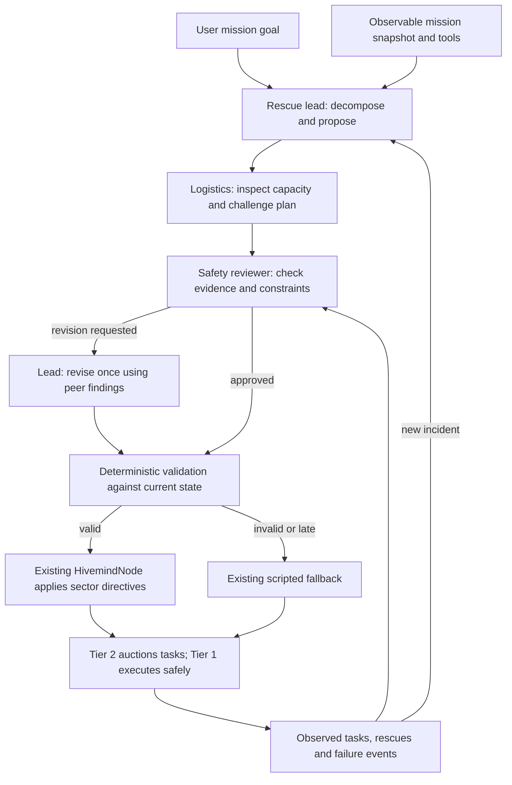

# SwarmMind: multi-agent application plan

This records the original proposed build. The implemented application, exact setup,
rehearsal evidence and remaining limitations are in [MULTI_AGENT_DEMO.md](MULTI_AGENT_DEMO.md).
The proposal below is retained as planning history, not a new shipping decision.
The supplied prize brief is the requirements source; official framework documentation
is linked below. Eligibility has not been independently confirmed with the organizer.

**Recommendation:** add a three-agent incident-response team above the existing swarm.
Use WorkSwarm 0.2.6 if a compatibility spike passes. Keep the application
adapter independent of that runtime, and preserve the rehearsed simulator as the fallback.
The deliverable is a working customized application; packaging a reusable Swarm Skill
comes after the end-to-end scenario works.

## 1. What the project actually does

SwarmMind simulates disaster search and rescue under incomplete information. Its
current [scenario](../assets/scenarios/demo.yaml) has 512 robots on a 360 × 240 m map,
48 sectors, 110 casualties including 44 buried casualties, and a 420-second mission.
The actual lane counts are **171 scouts, 117 diggers, 96 carriers, 128 relays**.
The four demo maps are defined once in `demo_seeds`: 42–45.

The rescue chain is already collaborative: scouts and other robots detect contacts;
diggers uncover buried casualties; carriers deliver them to collection points; relays
extend the communication network through which discoveries become shared knowledge.
Reports can be wrong, and disconnected robots buffer observations.

Three layers separate responsibilities:

| Layer | Current responsibility | Preserve |
|---|---|---|
| Tier 1, 20 Hz | Motion, collision avoidance, swept-circle safety override | Always authoritative |
| Tier 2, 1 Hz | Capability-gated market-based single-round reverse auction; task execution and reassignment | Works with Tier 3 completely silent |
| Tier 3 | Optional sector priorities through an asynchronous provider and feasibility filter | No per-robot commands; directives expire after 30 seconds |

The 3D Godot display visualizes a **custom 2.5D kinematic simulator**. FastSim and
DemoSim share physics. The current local bus is synchronous; the design document's
older description of an asyncio bus does not match `bus/local.py`.

The project already has a strong visual foundation: 15 articulated robot variants,
streamed terrain, and distance-dependent detail. M-78 records native Godot checks,
superseding older documentation about Godot being unavailable. Those
measurements used a static fixture, not the full live simulator/model/runtime stack.

Current component status, from code plus the measurement record:

| Component | Actual status |
|---|---|
| Robot bodies | MAP-Elites evolved roster; classical bid weights by default |
| Perception | Classical detector over occluded camera imagery |
| CNN detector | Trained, evaluated, below the shipping margin: M-74 |
| Local hivemind | Stock Qwen2.5-1.5B when its server is available; scripted fallback |
| Hivemind fine-tuning | RAFT/DPO/GRPO ladder was not run |
| Commander | Off; failed the gate |
| Unit PPO policy | Kept, unused; tuned on the four demo maps and gated out |
| Zone routing | Off by default; M-76f supersedes the earlier adoption decision |

### Correct the public account first

Several contradictions could undermine an otherwise good demonstration:

- `SHIPPING.md` says zone routing ships, but `Mission(zone_routing=False)`, the runbook
  amendment, and M-76f say it remains off. Preserve the historical evaluation; make the
  gate report distinguish measured winners from the configuration actually selected.
  Do not hand-edit a generated report or rerun expensive gates just to repair prose.
- `RUNBOOK.md` still contains 80-casualty/768-robot text, earlier performance numbers,
  and the false current claim that the CNN was never trained.
- The runbook describes pressing **H** to disable the hivemind. Inspection found no
  `KEY_H` handler or mission consumer for that toggle. Treat it as unimplemented until
  an end-to-end check proves otherwise. Starting with `--no-hivemind` is supported.
- `TECHNICAL.md` contains old map sizes, performance estimates, and timeout values;
  `HivemindNode` currently defaults to **8 seconds per provider**, not the older five.

Keep historical measurements intact. Add a current-build summary and correct
the demo instructions against code/configuration and fresh rehearsal evidence.

## 2. Research: JiuwenSwarm and WorkSwarm

These are connected parts of the same ecosystem. JiuwenSwarm provides the underlying
multi-agent system; the official platform describes WorkSwarm as the workbench built
on it. [Official platform](https://docs.openjiuwen.com/).

| Item | Verified finding | Consequence for this build |
|---|---|---|
| JiuwenSwarm | Leader/Teammate coordination, shared artifacts, dependent tasks and agent messaging | Suitable model for explicit handoffs and review |
| WorkSwarm | Newer product/release line; 0.2.6 adds SwarmFlow 2.0 and trajectory visualization | Prefer its official release for a new integration |
| SwarmFlow | Python scripts support structured agent outputs, phases, timeouts, sessions and budgets | Prewrite a bounded workflow instead of generating orchestration during the demo |
| MCP | General tool servers support stdio, SSE and streamable HTTP | Expose narrow Python mission tools |
| Swarm Skills | Role, workflow, constraint and dependency files describe a reusable team | Useful submission packaging after the app works |

Sources: [Agent Team](https://github.com/openJiuwen-ai/jiuwenswarm/blob/develop/docs/en/AgentTeam.md),
[WorkSwarm release](https://github.com/openJiuwen-ai/jiuwenswarm/releases/tag/workswarm0.2.6),
[SwarmFlow guide](https://github.com/openJiuwen-ai/jiuwenswarm/blob/develop/docs/en/TUISwarmFlowGuide.md),
[MCP configuration](https://github.com/openJiuwen-ai/jiuwenswarm/blob/develop/docs/en/MCPConfiguration.md),
[Swarm Skills](https://github.com/openJiuwen-ai/jiuwenswarm/blob/develop/docs/en/SwarmSkills.md).

**Version to pin:** `workswarm==0.2.6`. PyPI lists Python
`>=3.11,<3.14`, which includes this project's 3.12.
[Published wheel](https://pypi.org/project/workswarm/0.2.6/).

The installation guide says wheels include frontend assets; normal non-browser use
does not require Node. It recommends 4 GB RAM, with more for heavier capabilities.
That is not a measured incremental RSS figure, but it makes full workbench residency
a serious concern on this machine. Use an isolated Python 3.12 environment, disable
unused browser/channel/vector features, and measure all processes together.
[Installation guide](https://github.com/openJiuwen-ai/jiuwenswarm/blob/develop/docs/en/InstallGuide.md).

The tagged source manifest has a broad dependency set and still declares an older
package version internally. Its command names also retain `jiuwenswarm-*`. Prefer the
published wheel and verify installed metadata/entry points. Do not assume that a
`workswarm-start` executable exists or copy unpinned installation commands from an
older README. [Tagged manifest](https://github.com/openJiuwen-ai/jiuwenswarm/blob/workswarm0.2.6/pyproject.toml).

The detailed guides inspected are on `develop`; their APIs must be checked against
the installed 0.2.6 package. No framework was installed or run during this research.
Local-model support does not establish that the existing 1.5B model can reliably drive
this framework's tool calls, or that it fits the demo's latency budget.

### Framework decision

Install the pinned wheel in a separate environment during implementation. Prove:

1. Two distinct roles exchange an intermediate result through the actual runtime.
2. A role invokes one observable-only mission tool, and a reviewer changes or rejects
   a proposal because of its result.
3. Structured output, local model connection, restricted tools and cancellation work.
4. The complete resident stack fits without growing swap or visibly stalling the demo.

If this fails, stop the framework integration. Use a small custom
Python coordinator with separate role contexts, typed messages, tool dispatch and
the same feedback loop. The supplied brief permits other frameworks. Identify this
honestly as **custom orchestration**, not WorkSwarm. A working team remains mandatory;
a few prompt calls with agent labels do not meet the acceptance criteria below.

Do not make a remote machine, external API key or venue Wi-Fi necessary to finish.

## 3. Proposed application: a rescue incident-response team

User goal: **“Search this disaster zone, prioritize confirmed casualties, and revise
the response when fire or robot failures change what is feasible.”**

Keep three persistent role identities with bounded, separate context. They can share
one local model server; there is no need for three model weights or inference servers.

| Agent | Contribution | Tools and deliverable |
|---|---|---|
| Rescue lead | Decomposes the goal into assessment, prioritization and review; creates and revises a sector plan | Observable snapshot and task backlog; proposed directives citing evidence |
| Logistics specialist | Tests the lead's proposal against available lane capacity, queued rescue work and contact coverage | Capacity/backlog tools; feasibility findings and an alternative sector priority |
| Safety reviewer | Independently challenges unsupported claims and unsafe or stale proposals; checks the observed outcome | Known-hazard view, validation tool and event history; approve/revise/reject plus reasons |

The logistics specialist must say **unknown** when telemetry cannot establish route
feasibility. A count of connected robots is not proof of an end-to-end safe route.
Exact route optimization, moving individual relays, and per-robot staging are outside
this application's action space.

This is collaboration only if the downstream decision depends on the specialist's
findings, the reviewer can block it, and execution feedback changes a later decision.
Store those dependencies explicitly. Summaries of three independent answers are not
sufficient.

### One concrete end-to-end scenario

1. Start a real mission on a demo seed. The lead creates an initial plan from observed
   state; the team sees no hidden casualty coordinates or actual hazard disc.
2. After observed fire or a confirmed rescue backlog changes, the lead proposes a
   sector priority. Logistics identifies a capacity/contact conflict and recommends an
   alternative using tool evidence. Safety approves it or requests a revision.
3. The revised plan passes the existing feasibility filter and changes sector priority
   or abandonment state. Show subsequent task announcements/awards and movement.
4. The existing fault injector destroys a working robot. Tier 2 reassigns the task;
   the team observes that recovery and updates its assessment. Credit the auction,
   not the LLM, for the sub-three-second self-heal.
5. Stop the team runtime. The simulator continues, falls back transparently, and
   finishes. A final incident report links proposals, objections, decisions and outcomes.

Choose the specific sectors and narration only after rehearsal. Do not invent live
disagreement, casualties or hazard observations. A deliberately invalid proposal can
be demonstrated separately as a clearly labeled verification test.

The defensible answer to “why multiple agents?” is **separate objectives and review
authority with observable cross-checking**: rescue demand, delivery capacity, and risk
must agree before action. A sufficiently capable single agent might also solve this;
show a matched single-agent comparison before claiming a performance advantage.

## 4. Integration design

### Knowledge boundary and tools

Build a compact, immutable observation in the simulator, using the same belief sources
as `hivemind/prompt.py`: observed sector hazard, tracker reports, current work and
lane aggregates. Export it through a bounded mailbox to the team runtime.

Do **not** connect the agents to the dashboard WebSocket: it deliberately includes
ground truth. Do not forward `SwarmState` wholesale either: it includes `victims_total`,
which the current hivemind prompt intentionally hides. Exclude seeds, appearance
rasters, hidden casualties, actual hazard geometry and simulator internals.
Disconnected-unit data must be treated as last-known/unknown, not fresh knowledge.

Initial proposed tool surface:

| Tool | Returns or does |
|---|---|
| `read_incident(snapshot_id)` | Known sectors, contacts, recent relevant events, mission time |
| `read_capacity(snapshot_id, sector)` | In-contact lane counts, battery aggregates, known assigned/available work |
| `read_rescue_backlog(snapshot_id, sector)` | Observed investigate/dig/extract work, with uncertainty and evidence IDs |
| `check_plan(snapshot_id, proposal)` | Advisory preflight against a copied belief view; structured rejection reasons |
| `submit_plan(proposal_id)` | Enqueues a reviewed proposal; **does not mutate the world** |
| `read_outcome(proposal_id)` | Applied/rejected/expired status and subsequent observable events |

These are proposed application tools, not existing WorkSwarm APIs. WorkSwarm can
access them through a minimal Python MCP server; the custom runner calls the same
implementations directly. Disable unrelated shell/filesystem/browser tools so the
model cannot recover hidden simulator state through another path.

### Single writer and asynchronous execution

All application remains inside `HivemindNode` on the simulation thread. Its current
`_collect()` path parses, filters, applies and then publishes a directive. Publishing
directly to `/hivemind/directives` alone does **not** implement that effect.

Add a provider adapter that returns an already-completed team proposal immediately.
Run the longer team conversation independently; never join it in `Mission.tick()` or
in a synchronous `LocalBus` callback. Those callbacks may only capture/enqueue bounded
data. Perform file I/O, MCP and model calls outside the tick loop.

In team mode, the scripted provider handles periods without a usable team result.
Avoid simultaneously running the old single-model advisor against the same local
server. Accepted team directives receive the existing expiry; scripted proposals must
not overwrite a live team directive in the same sector on the next six-second poll.
Define this arbitration explicitly, with one final publisher and the existing
four-directive limit. An expired or invalid team proposal releases its authority.

Preserve the frozen bus and Godot wire schemas. Keep role messages and trace records
private to the new integration, rather than inventing `/swarm/events` kinds.
`HivemindSource` only permits `tuned-local`, `base-local`, `api`, and `scripted`;
the current local model therefore remains `base-local`. The team/runtime identity
belongs in the separate trace. Do not use an invalid `workswarm` source value.

### Resource and freshness limits

These are **initial engineering budgets to measure**, not current performance claims:

- One active team workflow and one model request at a time; sequential inference is
  acceptable. Three required role turns, at most one lead revision.
- Trigger on meaningful observed changes, with a 20-second minimum interval and a
  latest-snapshot queue of size one. Urgent safety remains Tier 1's responsibility.
- Target p95 below 15 seconds; hard team deadline 20 seconds. Drop late results.
- Accept only results from this mission/session, no more than 20 sim-seconds old,
  with still-valid evidence and prerequisites. Validate again against current state.
- No implicit renewal from polling the same proposal: consume its ID once. Renewal
  requires a fresh review; the existing directive lifetime stays at 30 seconds.
- Bound prompts and structured responses; start with at most 16 relevant sectors and
  roughly 120 output tokens per role. Establish a total token/tool-call budget in the spike.
- Record timeouts, tool failures, model identity and fallback explicitly. Cancel old
  requests on reset/disable; ignore all results from the prior mission generation.

Measure whole-stack RSS, swap growth, real-time factor and tick stalls. The older
runbook already measured Godot near 1.5 GB and paging with other apps open; the newer
rendering work has no concurrent full-stack RSS measurement. Do not assume the table
in TECHNICAL §9 represents available headroom today.

### Make collaboration visible without a dashboard rewrite

Use the WorkSwarm run view if it fits; otherwise a compact terminal trace beside
Godot. Show **role → tool/evidence → proposal → objection → revision → application →
observed outcome**, with one shared proposal ID. Save the same trace as JSONL.

Distinguish `LIVE TEAM`, `SCRIPTED FALLBACK` and `REPLAY`. Show a concise outcome
summary, not hidden model reasoning. A replay is a backup/example and never evidence
that a live model answered. “Task completed after this directive” is correlation;
only matched runs justify saying the directive caused an improvement.

## 5. Build sequence and file boundaries

| Deliverable | Done means |
|---|---|
| Baseline and current-build audit | Record commit, actual flags and fixture hash; identify stale judge-facing claims |
| WorkSwarm spike and runtime decision | Real handoff/tool/review succeeds within machine limits, or switch to custom runner |
| Observable snapshot, tools, mailbox and provider adapter | Scripted proposals affect the test fixture through the existing filter; bad/stale ones do not |
| Three roles and bounded feedback | Live specialist evidence changes a reviewed proposal; local-model failure is handled |
| Trace and full scenario | User goal through verified execution is visible; runtime stop leaves the swarm working |
| Regression and real-runtime checks | Required tests pass; no privileged input; slow-provider/expiry/fallback behavior verified |
| Rehearsal, backup recording and submission docs | Complete offline run and accurate narrated artifacts |

Proposed files, with names illustrative until the spike confirms the runtime API:

| Files | Responsibility |
|---|---|
| `swarmmind/hivemind/team/observations.py`, `tools.py` | Sanitized knowledge export and bounded mission tools |
| `swarmmind/hivemind/team/messages.py`, `coordinator.py` | Internal messages, proposal lifecycle, time budgets and feedback |
| `swarmmind/hivemind/team/workswarm_runtime.py` | Optional runtime binding; no WorkSwarm imports on the ordinary demo path |
| `swarmmind/hivemind/providers/team.py` | Immediate retrieval of reviewed results; provider boundary |
| `swarmmind/hivemind/team/trace.py` | Evidence IDs, application acknowledgments and terminal/JSONL output |
| `swarmmind/mission.py`, `cli.py`, `nodes/hivemind.py` | Explicit opt-in assembly and sole-writer arbitration |
| `assets/scenarios/team_response.yaml` | New cadence, expiry-age and output-budget configuration |
| `integrations/workswarm/` | Isolated dependency lock, model/MCP configuration and fixed workflow script |
| `tests/test_team_*.py` | Knowledge boundary, real handoff, application, staleness and failure cases |
| `docs/MULTI_AGENT_DEMO.md`, `README.md`, `docs/RUNBOOK.md` | Setup, exact demo invocation, agent responsibilities and truthful limitations |

The proposed flag is `--response-team`; it does not exist yet. Keep it off by default.
Ordinary headless runs must remain model-free and deterministic. Put new swarm-side
code under the already-guarded `hivemind/` tree; extend checks to external integration
scripts too. Internal role messages are not new bus contracts.

If time remains after validation, package the collaboration as
`integrations/workswarm/rescue-response/` with `SKILL.md`, three role files,
`workflow.md`, `bind.md`, `dependencies.yaml`, an executable workflow and one real
example trace. The installed release's validator decides the accepted metadata;
upstream examples currently use differing `team-skill`/`swarm-skill` terminology.
Packaging alone is not the application.

## 6. Acceptance criteria

**Collaboration and effect**

- All three roles make distinct contributions in a real workflow. Tool results and
  peer messages carry snapshot/proposal IDs and are consumed by later roles.
- A reviewer rejection prevents dispatch; a peer finding changes a proposal in a
  controlled fixture. No special-cased canned transcript counts as this test.
- An accepted plan changes the real sector state and downstream auction behavior.
- Outcome verification distinguishes accepted, applied, reassigned, rescued and
  expired. An accepted directive is not automatically a successful rescue.

**Reliability and invariants**

- `make check` passes on the final code. The latest recorded suite took about five
  minutes, so reserve that time; do not assume the suite takes seconds.
- Existing Tier-3-off mission/self-healing, safety and deterministic fixture tests stay green.
- New boundary tests exclude truth and casualty totals, reject unknown evidence, and
  demonstrate that hidden-world changes cannot change an identical exported observation.
- Slow, missing, malformed, rejected and duplicate results; runtime crash; deadline;
  mission reset; stale state; and directive expiration have deterministic tests.
- Verify a real local runtime as well as mocks. Instant mock providers previously
  concealed a blocking bug in this project.
- Live inference is not byte-deterministic. Preserve the existing headless guarantee;
  log model outputs and application times for clearly labeled replay.

**Measurement and claims**

- Unit tests and smoke missions use `test.yaml`; only construct/assert the demo config
  in routine checks. Do not start training, bounds or multi-mission jobs on this laptop.
- Rehearse the complete real-time demo stack on the demo machine, with the selected
  seed from `demo_seeds`. Verify offline operation and record the backup.
- Any claim that the team improves rescue score requires matched before/after evidence
  on the same machine and configuration, using the four demo maps. Compare scripted
  baseline, current single advisor and team with explicit token/wall-time budgets.
   Without that comparison, claim demonstrated collaboration and
  fault handling only; do not invent a rescue uplift or generalization result.
- Record measurements in a new row of `MEASUREMENTS.md`, including hardware, seeds,
  flags, framework/model versions, token usage, latency, fallback rate and limitations.
- The actual team must complete at least one episode during the shown mission.
  A run that silently uses the scripted rung throughout is not a team demo.

## 7. Scope cuts and submission

This application's scope excludes new RL/CNN/LLM training, commander tuning, zone-routing
adoption, more robots, ROS2/Gazebo, a new 3D interface, framework self-evolution,
distributed deployment or external data integrations. Existing physics and the four
demo layouts already supply the meaningful scenario.

Cut in this order: reusable skill packaging; custom collaboration UI; parallel model
inference; richer logistics estimates; the WorkSwarm runtime if its spike fails.
Keep the observable-only tools, real role interaction, verification, visible trace,
fallback and backup recording.

If live strategic control cannot be validated in time, retain the rehearsed robot
demo and ship the team as a **live incident-analysis and after-action application**:
it inspects observations, challenges a diagnosis, verifies it and produces an evidence-
linked response report. State explicitly that its recommendations do not control the
robots. This is a smaller end-to-end application, not a control success claim.

Submission should include setup instructions, pinned dependencies, the user goal,
role/tool table, workflow diagram, real input/output trace, run command, limitations,
fallback behavior and recording. Attribute WorkSwarm only if it actually executes
the demonstrated collaboration.

The rubric makes the ordering clear: collaboration (30%) plus demo completeness
(20%) justify spending the remaining time on a visible, reliable decision loop.
The existing rescue simulation already provides scenario value; another training run
does not address the largest remaining gap.
