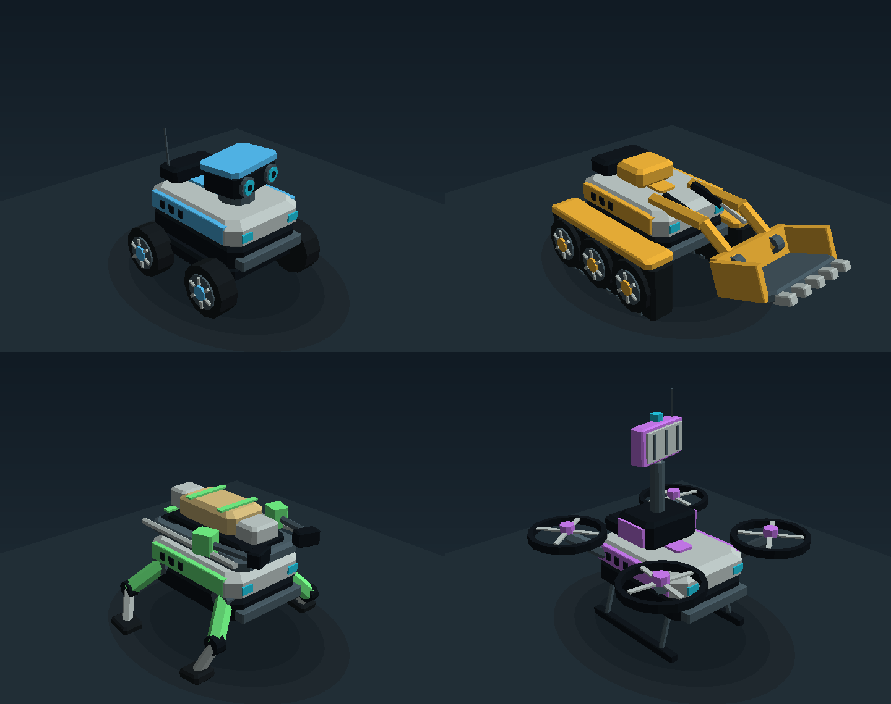

# Rescue fleet — models and animation

Open [the animated fleet gallery](units/index.html) locally. It includes purpose and
locomotion previews, all 15 variants, and downloads of the editable GLB files.



These models represent SwarmMind's rescue chain: find a casualty, uncover it if buried,
carry it to a collection point, and maintain the communication network throughout.
The current demo YAML defines 512 robots. The tactical auction remains independent
of the optional strategic hivemind. This is a 3D display of a **custom 2.5D kinematic
simulator**; mesh dimensions and joint motions do not alter its physics or perception.

## Four purposes, fifteen variants

| Role | Appearance | Working animation | GLB example |
|---|---|---|---|
| Scout (`none`) | Cyan shoulders, binocular camera housing, compact sensor pedestal | Camera gimbal sweeps during ground exploration/investigation | [Wheeled scout](../godot/assets/units/none_wheeled.glb) |
| Digger (`scoop`) | Amber reinforced arms, exposed hydraulic rods, wide toothed bucket | Bucket lifts and lowers at an active excavation | [Tracked digger](../godot/assets/units/scoop_tracked.glb) |
| Carrier (`gripper`) | Green padded jaws, stretcher rails, central rescue cradle | Jaws close around a visible secured load while carrying | [Legged carrier](../godot/assets/units/gripper_legged.glb) |
| Relay (`antenna`) | Violet radio rack, telescopic mast, panel antenna | Antenna head sweeps while holding a relay post | [Rotor relay](../godot/assets/units/antenna_rotor.glb) |

Each role has wheeled, tracked and legged versions. Scouts, diggers and relays also
have rotor versions. **There is no flying carrier:** that combination is prohibited
by the simulator. The gallery's four large models are examples of the modular system,
not a fixed relationship between purpose and chassis.

Wheels and track sprockets rotate with measured travel. The tracked body includes a
static belt and tread pads; its exposed drive sprockets animate. Four articulated legs
use an alternating diagonal gait. Rotor units have four guarded propellers and landing
skids. These are lightweight mechanical animations, without a skin or skeleton.

The coherent visual family uses pale armour, dark rubber and joints, brushed metal,
and the existing lane colours. Geometry identifies the tool even with colours disabled.
The `C` dashboard toggle recolours marked panels by chassis; neutral materials remain
neutral. Out-of-comms dims the entire model, and failure/destruction stops mechanisms
and applies the existing dark-red treatment.

## What the animations mean

The dashboard uses the existing eight-column robot row, active excavation positions,
and the additive `state.flight.airborne` array defined in `contracts/schemas.py`.
Flight flags come from the simulator; old recordings without them remain grounded.

- **Travel:** consecutive reported positions drive wheels and legs. Stationary robots
  keep their last locomotion pose. Reverse travel reverses the mechanism.
- **Digging:** the unit must be a digger assigned `dig`, within 2.5 m of a reported
  active excavation. A dig assignment alone includes travel and does not animate work.
- **Carrying:** `carry` closes the jaws and reveals the blanket-covered rescue load.
  `extract` means travelling to a casualty and keeps the cradle empty. Load changes
  follow telemetry directly; there is no invented pickup-duration animation.
- **Relay:** `relay_post` drives the antenna sweep. It does not depict message traffic.
- **Scouting:** only ground scouts exploring/investigating sweep the camera housing.
  This is cosmetic articulation; simulated camera direction and field of view stay fixed
  by the robot's actual pose.
- **Rotors:** blades spin for an operational unit. Airborne scouts, diggers and relays
  fly above other units, rubble, water and walls. Their level chassis follows a continuous
  altitude envelope with at least 8 m clearance above nearby terrain/water; it rises
  before mountains and accounts for the complete footprint and coarse terrain meshes.
  This is the height representation of the custom 2.5D simulator's flight layer, not
  a 3D aerodynamic model. Rotors land on safe dry ground to inspect or work; airborne
  cameras reveal no fog or casualties. A rotor scout does not perform the live camera sweep.
- **Failure and stale data:** status ≥ 2 stops every mechanism. Fresh telemetry permits
  at most 0.2 s of visual phase extrapolation; stale/disconnected feeds stop advancing.
  Reconnection and simulation resets discard old motion history.

The complete followed unit is hidden in first-person view so its camera cannot see
inside its own housing. Chase and orbit views show the full model.

## Edit and regenerate

The model of record is [units.py](../swarmmind/viz/units.py): original indexed geometry,
part colours, joint pivots and deterministic pose functions. Authoring coordinates are
metres, **Z up and +X forward**. Render dimensions are chosen for dashboard readability;
they do not replace the evolved collision radii.

```bash
uv run python scripts/design_units.py
```

This rebuilds:

1. `godot/assets/units/*.glb`: 15 self-contained, editable glTF 2.0 models. Each has
   named `idle`, `move`, its role's `scan`/`dig`/`carry`/`relay`, and `disabled` clips.
   Carrier work combines in-place locomotion with a secured load. Clips loop without
   root motion. GLB coordinates are Y up, +X forward.
2. `godot/assets/units/fleet_index.json`: the 3,964-byte runtime index. The live renderer
   loads individual `*_lod0.json`, `*_lod1.json`, and `*_lod2.json` meshes only when needed.
   `fleet.json` remains the complete source archive; `catalog.json` records asset sizes.
3. `docs/units/`: static PNGs, animated PNGs, and an offline HTML gallery. No server,
   JavaScript library, texture download, Blender or new Python dependency is required.

`--static` regenerates still previews without rendering animated PNGs. A full preview
build measured 127.05 s on the development machine. The gallery respects reduced-motion
preferences on initial load; its clip buttons explicitly opt into animation previews.

The Godot loader builds a MultiMesh only for each visible variant/detail combination.
The vertex shader animates rigid joints; no per-robot scene trees or extra process are
needed. Joint axes account for the dashboard's coordinate reflection, and locomotion
phases wrap to preserve Compatibility renderer precision.

There are three geometry levels: 1,780–4,028 triangles for close inspection, 200–324 at
medium distance, and 84–120 for distant silhouettes. Projected size and camera FOV decide
which is used. At most 12 visible units use full detail simultaneously, with the selected
unit taking priority. Offscreen units submit no instances, and unused variant meshes
are released after eight seconds. Telemetry, colours, disabled state and travel history
continue while a unit is culled. The demo's 512-unit initial overview now submits **49,188
unit triangles**, versus 1,310,580 with every model at full resolution.

Grounded robots tilt and rest on the same continuous terrain triangles that Godot draws. Their
support footprint checks terrain vertices, including crests between feet and boundaries
between terrain detail levels. Changing a tile's detail immediately refreshes unit poses.
Airborne models remain level, and their camera anchors, distant silhouettes, culling
and click selection use the same flight altitude. First-person hides the selected shell;
chase retains its complete model.

All 15 editable GLBs total approximately 5.3 MiB. Packaged Godot exports must include
`assets/units/*.json` in the non-resource export filter. Editor runs need no extra setup.
See [terrain streaming](TERRAIN_RENDERING.md) for residency, camera detail and measurements.

API references: [Godot MultiMesh](https://docs.godotengine.org/en/stable/classes/class_multimesh.html),
[spatial shaders](https://docs.godotengine.org/en/stable/tutorials/shaders/shader_reference/spatial_shader.html),
and [glTF 2.0](https://registry.khronos.org/glTF/specs/2.0/glTF-2.0.html).

## Verification

The geometry was rendered and inspected through `swarmmind/viz/render3d.py` before the
Godot port. The same mesh pass now renders nearby robots in ordinary offline snapshots;
far robots retain cheap markers. `scripts/snapshot3d.py` supplies actual activity codes.
Terrain and props use deterministic display mathematics; viewing a mission never consumes
the simulator's random generators.

Tests independently decode GLB geometry, normals, pivots and animation channels; check
clip loops and payload visibility; compare the shader's angle expressions and coordinate
conversion against offline poses; check ground clearance through work/travel phases;
and verify that rendering preserves mission arrays, RNG state and the next tick.
The existing bridge, safety, perception and determinism tests remain part of `make check`.
That command now uses the documented small `test.yaml` smoke mission; `make headless`
remains the explicit full demo run.

Native Godot 4.7.2 is now available on this machine. Import, Compatibility shader
compilation, native screenshots, camera transitions and rendering counters have been
checked. Executable Godot tests cover visibility, deferred mesh loading, LOD, eviction,
telemetry continuity, terrain support and reconnection. Pytest runs these automatically
when the engine is installed, and skips them on machines without Godot.

Measurements and the final project check are recorded in [M-78](MEASUREMENTS.md#m-78--streamed-terrain-and-unit-detail-17-sep).
